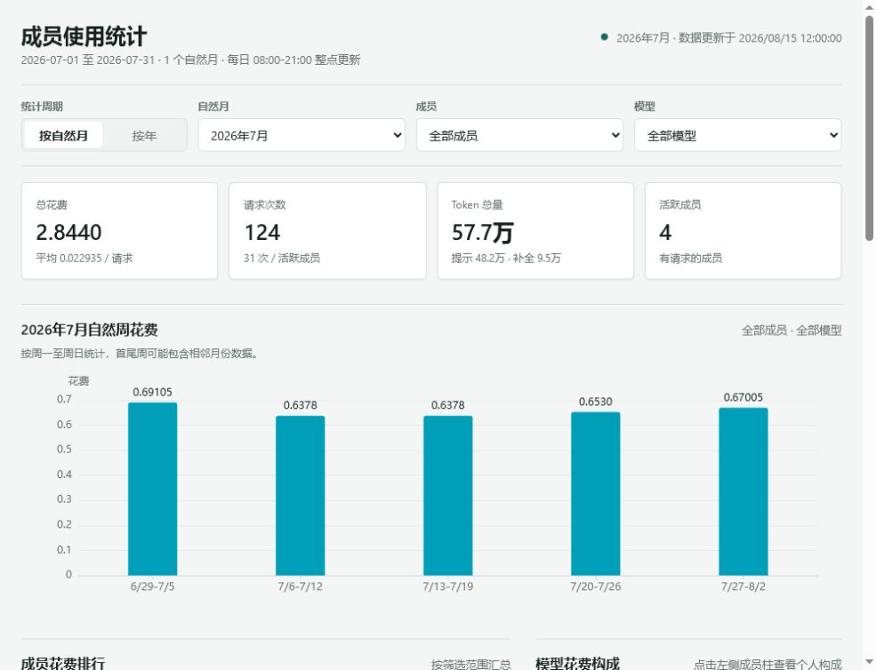
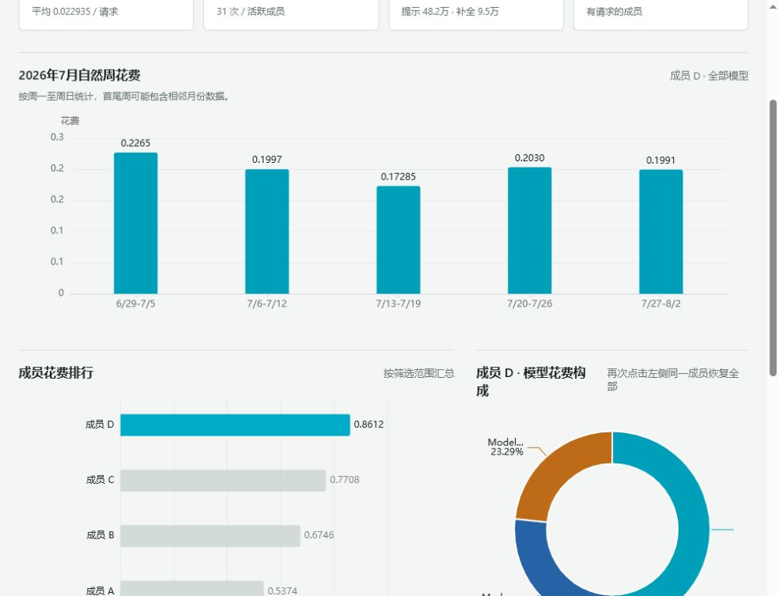
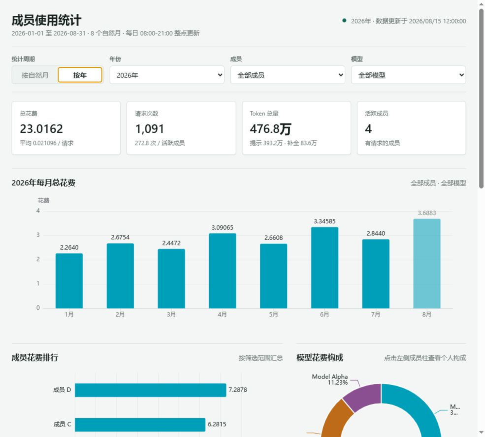

# New API Usage Dashboard

English | [中文](README.md)

A static usage analytics dashboard for New API. A server-side Python job downloads exported CSV logs and archives them by calendar month. The browser loads those files and performs filtering, aggregation, and chart rendering locally.

Features:

- Calendar month and calendar year views
- Member and model filters
- Cost, request, token, and active-member metrics
- Weekly cost totals for calendar-month views and monthly cost totals for calendar-year views
- Member cost ranking and model cost breakdown
- Daily heatmap switchable between requests, cost, and tokens
- Member usage trends and a detailed records table

## Screenshots

All screenshots below use fully synthetic demo data. They contain no real members, organizations, or request records.

### Monthly overview

Calendar weeks run from Monday through Sunday, so the first and last week can include dates from adjacent months.



### Member model breakdown

Selecting an anonymous member's cost bar updates the period summary, model breakdown, and heatmap for that member.



### Annual monthly cost totals



## Architecture

```text
New API log export endpoint
  -> server/update_dashboard.py
  -> /var/www/newapi-dashboard/data/months/YYYY/YYYY-MM.csv
  -> /var/www/newapi-dashboard/data/index.json
  -> Nginx
  -> index.html + ECharts + Papa Parse in the browser
```

The page is entirely static and never receives API credentials. The export URL, user ID, and access token remain in protected files on the server.

## Repository layout

```text
.
|-- index.html
|-- server/
|   `-- update_dashboard.py
|-- deploy/
|   |-- deploy-dashboard.ps1
|   `-- nginx-newapi-dashboard.conf
|-- vendor/
|   |-- echarts.min.js
|   `-- papaparse.min.js
|-- .gitignore
|-- README.md
|-- README_EN.md
`-- THIRD_PARTY_NOTICES.md
```

Generated CSV files, logs, runtime state, passwords, and API credentials are excluded by `.gitignore`.

## Requirements

An Ubuntu server with:

- Python 3.6 or newer
- Nginx
- `cron` and `flock`
- `apache2-utils` for creating an Nginx Basic Auth password file

Install the packages:

```bash
sudo apt update
sudo apt install -y nginx python3 cron util-linux apache2-utils
```

The updater can run as your existing non-root Linux user. A dedicated user is optional.

## 1. Clone the repository

Replace the URL with your repository URL:

```bash
git clone https://github.com/YOUR_NAME/newapi-dashboard.git ~/newapi-dashboard
cd ~/newapi-dashboard
```

## 2. Create directories and install files

Give the current user write access to the site directory. Nginx only requires read access:

```bash
sudo install -d -o "$USER" -g "$USER" -m 755 /var/www/newapi-dashboard /var/www/newapi-dashboard/data /var/www/newapi-dashboard/vendor
install -m 644 index.html /var/www/newapi-dashboard/index.html
install -m 644 vendor/echarts.min.js vendor/papaparse.min.js /var/www/newapi-dashboard/vendor/
install -d -m 755 "$HOME/newapi-dashboard-runtime/logs" "$HOME/newapi-dashboard-runtime/state"
install -m 750 server/update_dashboard.py "$HOME/newapi-dashboard-runtime/update_dashboard.py"
```

## 3. Configure the export endpoint and credentials

The updater requires:

- The full export URL, such as `https://new-api.example.com/api/log/self/export`
- The user ID sent in the `New-Api-User` header
- A user access token

Create a private configuration directory:

```bash
install -d -m 700 "$HOME/.config/newapi-dashboard"
```

Enter the full export URL:

```bash
read -rp "Export URL: " NEW_API_EXPORT_URL; printf '%s\n' "$NEW_API_EXPORT_URL" > "$HOME/.config/newapi-dashboard/export_url"; chmod 600 "$HOME/.config/newapi-dashboard/export_url"; unset NEW_API_EXPORT_URL
```

Enter the user ID:

```bash
read -rp "New-Api-User: " NEW_API_USER_ID; printf '%s\n' "$NEW_API_USER_ID" > "$HOME/.config/newapi-dashboard/user_id"; chmod 600 "$HOME/.config/newapi-dashboard/user_id"; unset NEW_API_USER_ID
```

Enter the access token without displaying it in the terminal:

```bash
read -rsp "Access token: " NEW_API_TOKEN; printf '\n'; printf '%s\n' "$NEW_API_TOKEN" > "$HOME/.config/newapi-dashboard/access_token"; chmod 600 "$HOME/.config/newapi-dashboard/access_token"; unset NEW_API_TOKEN
```

Never put these values in source code, Git history, cron entries, or shell commands saved in documentation.

## 4. Download the initial data

Run the updater once:

```bash
python3 "$HOME/newapi-dashboard-runtime/update_dashboard.py"
```

It will:

1. Download the current calendar month.
2. Download and finalize the previous month on the first run.
3. Write monthly files under `/var/www/newapi-dashboard/data/months/`.
4. Generate `/var/www/newapi-dashboard/data/index.json`.

Force a refresh of the previous month when needed:

```bash
python3 "$HOME/newapi-dashboard-runtime/update_dashboard.py" --refresh-previous
```

Month boundaries are calculated in UTC+8 and do not depend on the server's current timezone.

### Optional environment variables

| Variable | Default behavior |
|---|---|
| `NEW_API_EXPORT_URL` | Reads `export_url` from the config directory |
| `NEW_API_CONFIG_DIR` | `~/.config/newapi-dashboard` |
| `NEW_API_USER_ID` | Reads `user_id` from the config directory |
| `NEW_API_ACCESS_TOKEN` | Reads `access_token` from the config directory |
| `NEW_API_DATA_DIR` | `/var/www/newapi-dashboard/data` |
| `NEW_API_STATE_DIR` | `~/newapi-dashboard-runtime/state` |

Credential files with mode `600` are recommended because environment variables may be recorded by process managers.

## 5. Configure Nginx and authentication

The provided configuration enables HTTP Basic Auth. Replace `dashboard` with your preferred login name:

```bash
sudo htpasswd -c /etc/nginx/.htpasswd dashboard
```

Install and enable the site configuration:

```bash
sudo install -m 644 deploy/nginx-newapi-dashboard.conf /etc/nginx/sites-available/newapi-dashboard
sudo ln -sfn /etc/nginx/sites-available/newapi-dashboard /etc/nginx/sites-enabled/newapi-dashboard
sudo rm -f /etc/nginx/sites-enabled/default
sudo nginx -t
sudo systemctl reload nginx
```

Open the dashboard in a browser:

```text
http://SERVER_IP/
```

To disable authentication, remove these lines from the Nginx configuration and reload Nginx:

```nginx
auth_basic "New API Dashboard";
auth_basic_user_file /etc/nginx/.htpasswd;
```

Basic Auth does not encrypt credentials over plain HTTP. Use it only on a trusted LAN. Public access requires HTTPS, a strong password, and appropriate firewall rules.

## 6. Schedule automatic updates

Set and verify the server timezone:

```bash
sudo timedatectl set-timezone Asia/Shanghai
date
```

Edit the current user's crontab:

```bash
crontab -e
```

The following schedule runs hourly from 08:00 through 21:00. Replace `/home/YOUR_USER` with the path printed by `echo "$HOME"`:

```cron
TZ=Asia/Shanghai
0 8-21 * * * flock -n /home/YOUR_USER/newapi-dashboard-runtime/update.lock /usr/bin/python3 /home/YOUR_USER/newapi-dashboard-runtime/update_dashboard.py >> /home/YOUR_USER/newapi-dashboard-runtime/logs/update.log 2>&1
```

Inspect the update log:

```bash
tail -n 50 "$HOME/newapi-dashboard-runtime/logs/update.log"
```

## 7. Deploy later updates

### Pull updates on the server

```bash
cd ~/newapi-dashboard
git pull --ff-only
install -m 644 index.html /var/www/newapi-dashboard/index.html
install -m 644 vendor/echarts.min.js vendor/papaparse.min.js /var/www/newapi-dashboard/vendor/
install -m 750 server/update_dashboard.py "$HOME/newapi-dashboard-runtime/update_dashboard.py"
```

### Upload static assets from Windows

Run in PowerShell and replace the server address:

```powershell
powershell.exe -NoProfile -ExecutionPolicy Bypass -File ".\deploy\deploy-dashboard.ps1" -Server "user@SERVER_IP"
```

The script uploads only `index.html` and `vendor/`. It never uploads CSV data or credentials. The remote directory and ownership must be configured before the first deployment.

## 8. Verification and troubleshooting

Check Nginx:

```bash
sudo nginx -t
systemctl is-active nginx
curl -I -u 'YOUR_LOGIN:YOUR_PASSWORD' http://127.0.0.1/
```

Check generated data:

```bash
cat /var/www/newapi-dashboard/data/index.json
find /var/www/newapi-dashboard/data/months -type f -name '*.csv' -ls
```

Run the updater interactively to see errors:

```bash
python3 "$HOME/newapi-dashboard-runtime/update_dashboard.py"
```

Common failures:

- `401` or `403`: the user ID or access token is invalid or expired.
- `Permission denied`: the current user cannot write to `/var/www/newapi-dashboard`.
- Missing chart dependencies: verify both JavaScript files under `/var/www/newapi-dashboard/vendor/`.
- No months in the selector: verify `data/index.json` and ensure at least one month has `rows` greater than `0`.
- Cron does not run: inspect `crontab -l`, the server timezone, and the updater log.

## Data and security

- Exported CSV files may contain member names, token names, request IDs, and usage history. Never commit them.
- Never commit the export URL if it is private, access tokens, user ID files, Nginx password files, SSH private keys, or runtime logs.
- `index.html` may contain member aliases used to merge historic names. Review them before publishing this repository.
- Deleting a leaked credential in a later commit does not remove it from Git history. Revoke it immediately and rewrite the repository history.

## Third-party components

The frontend includes Apache ECharts 5.5.1 and Papa Parse 5.4.1. See [THIRD_PARTY_NOTICES.md](THIRD_PARTY_NOTICES.md).
